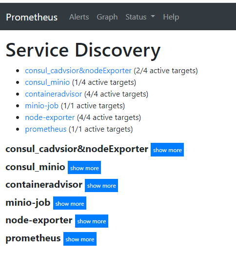
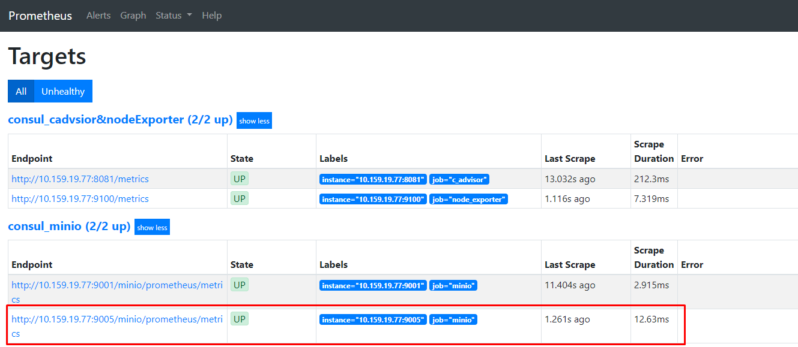

# Hướng dẫn tích hợp giám sát minIO cluster và host vật lý sử dụng Consul để auto discover
## Đầu bài:
- Giám sát tải tới cụm minIO và trạng thái sử dụng tài nguyên của minIO cluster.
- Giám sát tình trạng tài nguyên của host vật lý và các container trong host đó
- Tự động cập nhật cụm minIO mới hoặc host mới, triển khai lên hệ thống giám sát.

## Giải pháp:
 - Sử dụng Consul để auto discover các host vật lý mới, container mới và cụm minIO cluster mới triển khai.
 - Prometheus để thu thập metric của minIO cluster.
 - Grafana để visualize metric thành biểu đồ theo dõi.

## Mô hình lab:
 - minIO cluster: gồm 4 node, IP: 10.159.19.77-80, GW: 10.159.19.81
 - Consul Server: IP: IP 10.159.19.84
 - Prometheus + Grafana: IP 10.159.19.84


## 1. Cài đặt promethus để giám sát minIO cluster
Thực hiện theo hướng dẫn tại [đây](https://github.com/VNPT-SmartCloud-System/Tim-hieu-minIO/blob/master/docs/monitor-minIOCluster-Prometheus%2BGrafana.md)

## 2. Cài đặt Node-exporter để thu thập metric container
Thực hiện theo hướng dẫn tại [đây](https://github.com/VNPT-SmartCloud-System/Tim-hieu-minIO/blob/master/docs/monitorHost_nodexporter%2Bprometheus%2Bgrafana.md)

## 3. Cài đặt cAdvisor để thu thập metric container
Thực hiện theo hướng dẫn tại [đây](https://github.com/VNPT-SmartCloud-System/Tim-hieu-minIO/blob/master/docs/monitorContainer_cadvisor%2Bprometheus%2Bgrafana.md)

## 4. Cài đặt Consul để thu thập metric
Consul Server được cài trên host 10.159.19.84, Consul client được cài trên các host minIO

### 4.1. Download gói binaries của Consul. Phiên bản sử dụng là 1.7.0, điều chỉnh theo phiên bản mới nhất
```sh
export CONSUL_VERSION="1.7.0"
curl --silent --remote-name https://releases.hashicorp.com/consul/${CONSUL_VERSION}/consul_${CONSUL_VERSION}_linux_amd64.zip
curl --silent --remote-name https://releases.hashicorp.com/consul/${CONSUL_VERSION}/consul_${CONSUL_VERSION}_SHA256SUMS
curl --silent --remote-name https://releases.hashicorp.com/consul/${CONSUL_VERSION}/consul_${CONSUL_VERSION}_SHA256SUMS.sig
```

### 4.2. Cài đặt Consul
```sh
unzip consul_${CONSUL_VERSION}_linux_amd64.zip
sudo chown root:root consul
sudo mv consul /usr/local/bin/
```
Kiểm tra phiên bản
```sh
consul --version
```

Kết quả:
```sh
Consul v1.7.0
Protocol 2 spoken by default, understands 2 to 3 (agent will automatically use protocol >2 when speaking to compatible agents)
```

## 4.3. Bật tính năng autocompletion để tự động sửa các option trong câu lênh `consul`
```sh
consul -autocomplete-install
complete -C /usr/local/bin/consul consul
```

## 4.4. Tạo user consul và thư mục của nó
```sh
sudo useradd --system --home /etc/consul.d --shell /bin/false consul
sudo mkdir --parents /opt/consul
sudo chown --recursive consul:consul /opt/consul
```

## 4.5. Tạo service systemd `/etc/systemd/system/consul.service` để quản lý Consul dưới dạng service
```sh
[Unit]
Description="HashiCorp Consul - A service mesh solution"
Documentation=https://www.consul.io/
Requires=network-online.target
After=network-online.target
ConditionFileNotEmpty=/etc/consul.d/consul.hcl

[Service]
Type=notify
User=consul
Group=consul
ExecStart=/usr/local/bin/consul agent -config-dir=/etc/consul.d/
ExecReload=/usr/local/bin/consul reload
KillMode=process
Restart=on-failure
LimitNOFILE=65536

[Install]
WantedBy=multi-user.target
```

## 4.6. Tạo file cấu hình cho Consul
```sh
sudo mkdir --parents /etc/consul.d
sudo touch /etc/consul.d/consul.hcl
sudo chown --recursive consul:consul /etc/consul.d
sudo chmod 640 /etc/consul.d/consul.hcl
```

Chỉnh sửa file `/etc/consul.d/consul.hcl` với nội dung
```sh
datacenter = "lab"
data_dir = "/opt/consul"
encrypt = "pju04BkafjtJ19xONoFGWL/BQG1/qO+TEojredSrTTM="
retry_join = ["10.159.19.84"]
bind_addr = "10.159.19.84"

performance {
  raft_multiplier = 1
}
```

Trong đó keygen `pju04BkafjtJ19xONoFGWL/BQG1/qO+TEojredSrTTM=` có thể được sinh bằng lệnh `consul keygen`

## 4.7. Tạo file cấu hình cho Consul Server (consul client không thực hiện đoạn này)
```sh
sudo touch /etc/consul.d/server.hcl
sudo chmod 640 /etc/consul.d/server.hcl
sudo chown --recursive consul:consul /etc/consul.d
vim /etc/consul.d/server.hcl
```

Chỉnh sửa file `/etc/consul.d/server.hcl` với nội dung
```sh
server = true
bootstrap_expect = 1
ui = true
bind_addr = "10.159.19.84"
client_addr = "0.0.0.0"
```

## 4.8 Kiểm tra việc cài đặt
```sh
consul members
```

Kết quả:
```sh
Node        Address            Status  Type    Build  Protocol  DC   Segment
minio8-dev  10.159.19.84:8301  alive   server  1.7.0  2         lab  <all>
minio1-dev  10.159.19.77:8301  alive   client  1.7.0  2         lab  <default>
```

## 5. Cấu hình Discovery trên Consul
### 5.1. Cấu hình để Consul tự động lấy metric mới từ node exporter và gửi về Prometheus
Trên host minIO, tại thư mục `/etc/consul.d`, tạo file `node_exporter.json` với nội dung

```sh
{
  "service":
  {"name": "node_exporter",
   "tags": ["node_exporter&c_advisor", "prometheus"],
   "port": 9100
  }
}
```

### 5.2. Cấu hình để Consul tự động lấy metric container mới từ cAdvisor và gửi về Prometheus
Trên host minIO, tại thư mục `/etc/consul.d`, tạo file `c_advisor.json` với nội dung
```sh
{
  "service":
  {"name": "c_advisor",
   "tags": ["node_exporter&c_advisor", "prometheus"],
   "port": 8081
  }
}
```

### 5.3. Cấu hình để Consul tự động lấy metric từ minIO và gửi về Prometheus
Trên host minIO, tại thư mục `/etc/consul.d`, tạo file `minio.json` với nội dung

```sh
{
  "service":
  {"name": "minio",
   "tags": ["minio", "prometheus"],
   "port": 9001
  }
}
```

## 5.4. Kiểm tra Consul đã discover được các services
```sh
consul catalog services
```

Kết quả:
```sh
c_advisor
consul
minio
node_exporter
```

### 5.5. Tại host Prometheus, sửa file `prometheus.yml` để bổ sung các cấu hình Consul

```sh
  - job_name: 'consul_cadvsior&nodeExporter'
    consul_sd_configs:
      - server: '10.159.19.84:8500'
    relabel_configs:
      - source_labels: [__meta_consul_tags]
        regex: .*,node_exporter&c_advisor,.*
        action: keep
      - source_labels: [__meta_consul_service]
        target_label: job

  - job_name: 'consul_minio'
    metrics_path: /minio/prometheus/metrics
    consul_sd_configs:
      - server: '10.159.19.84:8500'
    relabel_configs:
      - source_labels: [__meta_consul_tags]
        regex: .*,minio,.*
        action: keep
      - source_labels: [__meta_consul_service]
        target_label: job
```

### 5.6. Khởi động lại Prometheus, kiểm tra trên dashboard của Prometheus thấy xuất hiện các Service discovery từ Consul


### 5.7. Đăng ký Service mới để Consul discover
Trên host Consul server, tạo file `minio_register.json` tại thư mục `/etc/consul.d` với nội dung
{
  "ID": "minio-dev",
  "Name": "minio",
  "Tags": ["minio", "prometheus"],
  "Address": "10.159.19.77",
  "Port": 9005,
  "Meta": {
    "minio_version": "minio:RELEASE.2020-01-16T22-40-29Z"
  }
}

Trên host Consul server, đăng ký service mới thông qua REST-ful API
```sh
curl \
    --request PUT \
    --data @minio_register.json \
    http://127.0.0.1:8500/v1/agent/service/register?replace-existing-checks=true
```

Kiểm tra trên dashboard của Prometheus đã thấy xuất hiện service mới đăng ký



# Tham khảo:
- https://learn.hashicorp.com/consul/datacenter-deploy/deployment-guide
- https://stuarthowlette.me.uk/posts/prometheus-consul-node_exporter/
- https://www.robustperception.io/finding-consul-services-to-monitor-with-prometheus
- https://www.consul.io/api/agent/service.html
- https://www.consul.io/docs/commands/services/register.html
